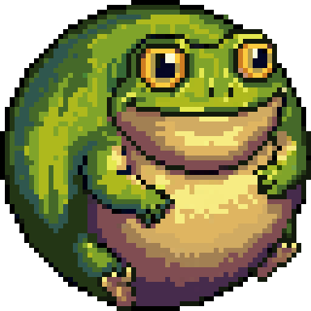

<div>

<div>



# Giant Toad

<div>

Warning

Giant Toad is under active development. Until version 1.0.0, APIs, project formats, and behavior may change between releases. Pin your dependency version and review the changelog before upgrading.

</div>

Giant Toad is an opinionated, typed **pixel-art game engine layer for Flutter and Flame**.

Games are written in Dart. Flame remains the component, world, camera, input, effect, collision, particle, and rendering foundation. Giant Toad adds only the pixel-game policies and reusable systems that Flame intentionally leaves to a game or higher-level engine.

## Direction

``` text
Dart game code → Giant Toad pixel-art conventions → Flame → Flutter
```

Giant Toad does not wrap Flame merely to rename its APIs. Projects can use Flame components directly. Engine APIs focus on:

- 800×600 authored resolution, expanding viewport, and fixed 2× pixel scale (1600×900 displays 800×450 logically);
- fixed, two-axis expanding, or width-expanding viewport policies;
- canvas/logical/world coordinate conversion;
- sparse JSON map documents and reversible editing contracts;
- semantic actions and gamepad/keyboard rebinding;
- pixel-oriented Flutter overlays, focus, menus, HUD, and nine-slice styling;
- reusable gameplay algorithms not already supplied by Flame;
- project validation, packaging conventions, and deterministic tests.

## Current foundation

Implemented today:

- `GiantToadGame` and configurable logical pixel viewport;
- pixel coordinate helpers and editor camera math;
- sparse map, area, chunk, grid, edit, and tile-rendering models;
- semantic action maps;
- Flutter pixel UI theme, focus, overlays, menus, dialogue, HUD widgets, and nine-slice presentation;
- pathfinding, steering, deterministic RNG, dialogue, non-component pooling, trauma camera shake, diagnostics, persistent saves/settings, and isolate workers;
- tilesets, typed objects/areas, autotiles, sparse rendering, tile collision, and a kinematic pixel body;
- Flame sprite/animation conventions, post-process pixelation and lighting;
- semantic keyboard, pointer, joystick, and gamepad action adapters;
- audio buses, browser activation queues, and music crossfades through `flame_audio`;
- Flame `RouterComponent` scene lifecycle and owned-resource cleanup;
- reusable engine systems exercised by the separate example gallery;
- `gt init`, `gt validate`, `gt run`, and standard Flutter target exports.

Guides, engineering notes, and the generated Markdown API reference live in [`docs/`](../README.md).

## Package usage

``` dart
import 'package:flame/components.dart';
import 'package:flame/game.dart';
import 'package:flutter/widgets.dart';
import 'package:giant_toad/giant_toad.dart';

void main() {
  runApp(GameWidget(game: GiantToadGame(world: World())));
}
```

## CLI

``` sh
dart run bin/giant_toad.dart init my_game
dart run bin/giant_toad.dart validate my_game
dart run bin/giant_toad.dart run my_game
dart run bin/giant_toad.dart export --target web my_game
```

## Development

From the package root:

``` sh
flutter pub get
flutter analyze
flutter test
./tool/generate_docs.sh
```

</div>

<div>

## Libraries

<span class="name">[giant_toad](giant_toad/index.md)</span>  

<span class="name">[giant_toad_gameplay](giant_toad_gameplay/index.md)</span>  
Deterministic gameplay algorithms and reusable game-feel systems.

<span class="name">[giant_toad_render](giant_toad_render/index.md)</span>  
Pixel-oriented sprite, animation, lighting, and shader APIs.

<span class="name">[giant_toad_runtime](giant_toad_runtime/index.md)</span>  
Input, audio, persistence, scene, project, and runtime service APIs.

<span class="name">[giant_toad_tilemap](giant_toad_tilemap/index.md)</span>  
Sparse tilemap document, editing, rendering, area, and collision APIs.

<span class="name">[giant_toad_ui](giant_toad_ui/index.md)</span>  
Pixel-art game overlay widgets, theme primitives, and input integration.

</div>

</div>

<div>

<div>

</div>

1.  [giant_toad package](https://github.com/goblin-portal/giant-toad)

##### <span class="package-name">giant_toad</span> <span class="package-kind">package</span>

1.  Libraries
2.  [giant_toad](giant_toad/index.md)
3.  [giant_toad_gameplay](giant_toad_gameplay/index.md)
4.  [giant_toad_render](giant_toad_render/index.md)
5.  [giant_toad_runtime](giant_toad_runtime/index.md)
6.  [giant_toad_tilemap](giant_toad_tilemap/index.md)
7.  [giant_toad_ui](giant_toad_ui/index.md)

</div>

<div>

</div>
